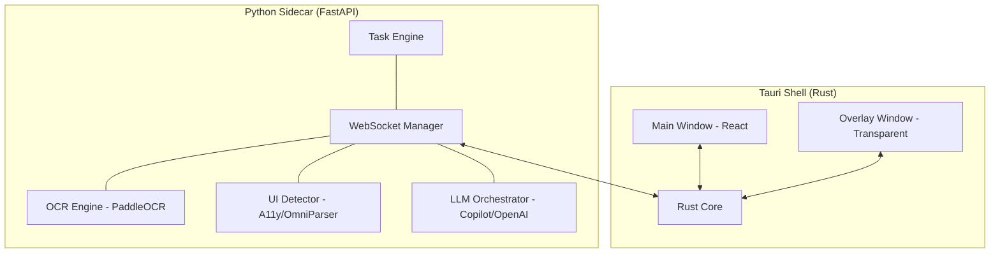

# 👑 StepPilot

> **AI Desktop Guidance Assistant** — An intelligent companion that watches your screen, understands the visible UI, and provides real-time visual guidance to help you complete complex tasks.

---

## 🌟 Overview

Cursor-King is a production-grade desktop application designed to bridge the gap between AI reasoning and local desktop interaction. By combining high-performance screen capture, local OCR, and state-of-the-art vision-language models, Cursor-King acts as a "copilot for your entire desktop."

### The Workflow
1.  **Request**: You ask the assistant to perform a task (e.g., "Send an 'OK' message to my WhatsApp group").
2.  **Observe**: The system captures your screen and parses every UI element, text, and icon.
3.  **Plan**: Using the GitHub Copilot SDK or OpenAI, it plans the exact steps needed.
4.  **Guide**: Instead of taking control immediately, it visually guides you with **animated arrows, highlights, and tooltips** on a transparent overlay.
5.  **Act (Post-MVP)**: Optionally, allow the agent to execute actions autonomously via mouse and keyboard tool calls.

---

## 🚀 Key Features

-   **Real-Time Visual Guidance**: Animated Bézier arrows and glowing bounding boxes lead the way.
-   **Context-Aware Intelligence**: Powered by GitHub Copilot SDK & OpenAI GPT-4o for deep UI understanding.
-   **Local-First Processing**: PaddleOCR and Windows Accessibility API processing happen locally for privacy and speed.
-   **Tauri v2 Architecture**: A lightweight, high-performance Rust shell with a modern React frontend.
-   **Autonomous Control (Coming Soon)**: Tool-calling capabilities for autonomous mouse and keyboard interaction.
-   **Transparent Overlay**: An always-on-top, click-through window for seamless visual assistance.

---

## 🛠️ Tech Stack

### Frontend & Desktop
-   **Framework**: [Tauri v2](https://tauri.app/) (Rust Backend + React/TS Frontend)
-   **UI Logic**: React 19, TypeScript, Zustand (State Management)
-   **Overlay Rendering**: SVG + CSS Animations (Hardware Accelerated)

### Backend (Sidecar)
-   **API Framework**: [FastAPI](https://fastapi.tiangolo.com/) (Python 3.11+)
-   **OCR Engine**: [PaddleOCR v4](https://github.com/PaddlePaddle/PaddleOCR) (Local, Free)
-   **Intelligence**: [GitHub Copilot SDK](https://github.com/github/copilot-sdk) & OpenAI API
-   **Automation**: PyAutoGUI, pywinauto (UIA)
-   **Communication**: WebSocket (Tauri ↔ Python)

---

## 🏗️ Architecture



---

## 📅 Roadmap (The 15-Sprint Plan)

We are currently following a **15-Sprint Roadmap** to take Cursor-King from an MVP to a fully autonomous desktop agent.

*   **Phase 1: MVP Foundation (Sprints 1-4)**: Scaffolding, Screen Capture, OCR, and LLM Integration.
*   **Phase 2: Visual Guidance (Sprints 5-7)**: Overlay Window, Animated Arrows, and Step Verification.
*   **Phase 3: Polish & Intel (Sprints 8-10)**: UI Refinement, Smart Prompting, and Robustness.
*   **Phase 4: Enhanced Vision (Sprints 11-12)**: OmniParser Integration and Visual Debug Mode.
*   **Phase 5: Autonomous Agent (Sprints 13-15)**: Mouse/Keyboard control and Safety Systems.

*Full roadmap details can be found in [sprints.md](./sprints.md).*

---

## ⚙️ Getting Started (Development)

### Prerequisites
-   **Windows 10/11** (Required for DXGI capture and UIA APIs)
-   **Rust** (via rustup)
-   **Node.js** (v18+)
-   **Python 3.11+**
-   **C++ Build Tools** (for PaddleOCR and Rust dependencies)

### Setup
1.  **Clone the Repository**:
   

2.  **Install Frontend Dependencies**:
    ```bash
    npm install
    ```

3.  **Setup Python Backend**:
    ```bash
    cd backend
    python -m venv venv
    ./venv/Scripts/activate
    pip install -r requirements.txt
    ```

4.  **Configure Environment**:
    Create a `.env` file in the root with your API keys:
    ```env
    OPENAI_API_KEY=your_key_here
    GITHUB_TOKEN=your_token_here
    ```

5.  **Run in Development**:
    ```bash
    ./scripts/dev.ps1
    ```

---

## 🔒 Security & Privacy

-   **Local Processing**: Screenshots are processed locally for OCR and UI detection.
-   **Redaction**: The system redacts sensitive keywords (passwords, credit cards) before sending data to LLM providers.
-   **Secure Storage**: API keys are stored in the Windows Credential Manager via the `keyring` library.

---

